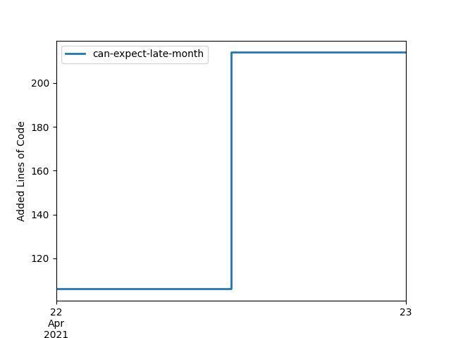

# Evaluate different formats of contributor feedback

In this repository, different formats of feedback for teams of students are evaluated. 

## Shields

 
 
 

## Text and Tables
| login          |   total_added_lines |   total_removed_lines |
|:---------------|--------------------:|----------------------:|
| SebastianZug   |                 279 |                   105 |
| actions-user   |                 139 |                   143 |
| andre-dietrich |                   3 |                     0 |
| galinarudollf  |                   1 |                     1 |
## Diagrams

# Task description

You are a C# developer and a customer ? In this role you will ...
